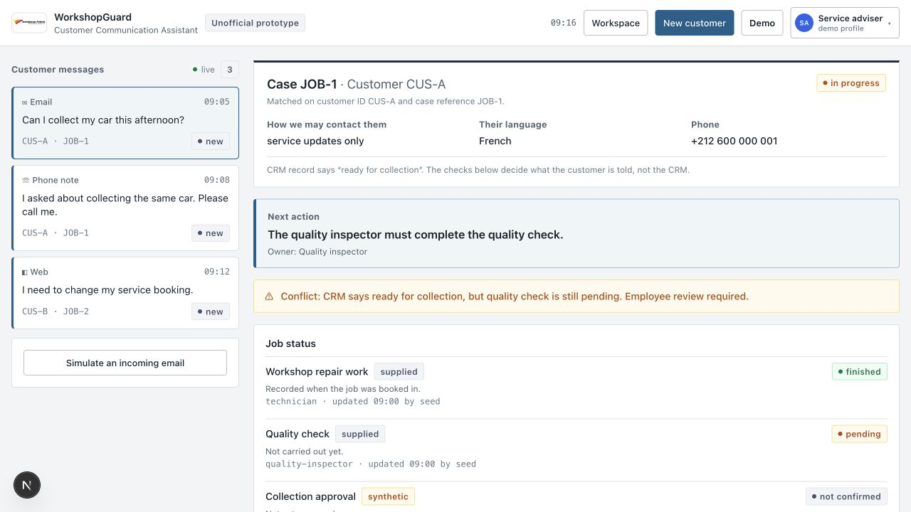
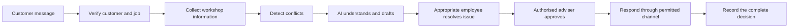
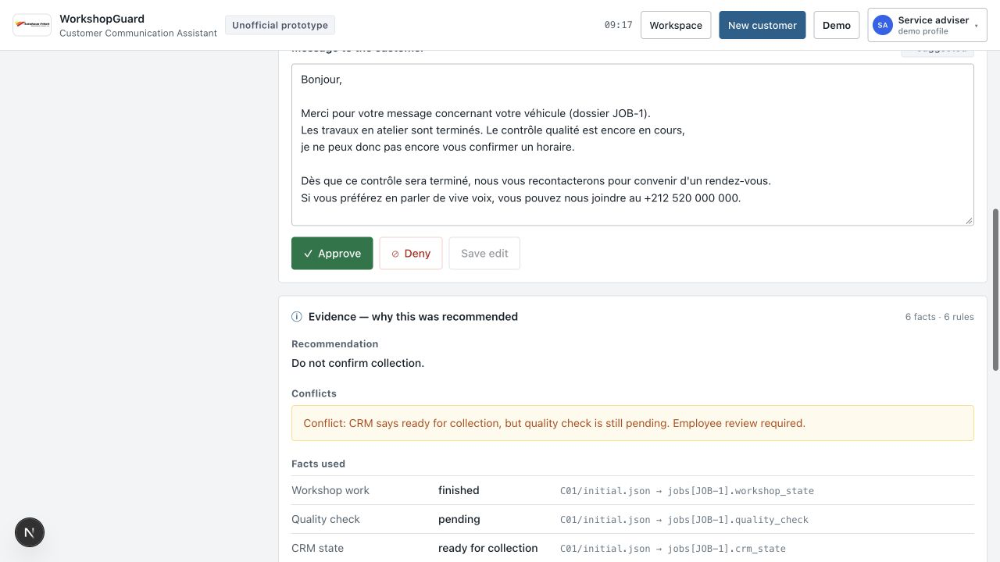
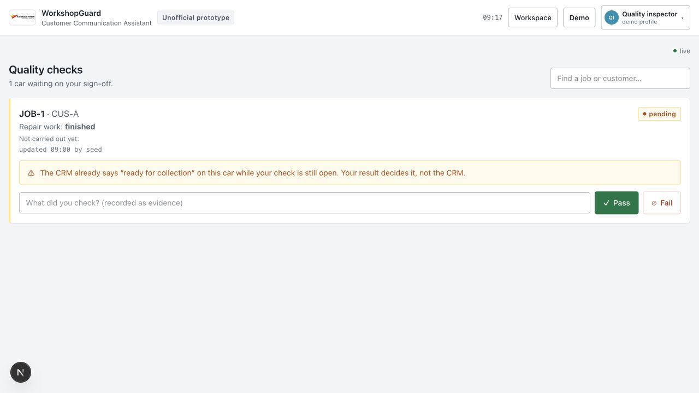
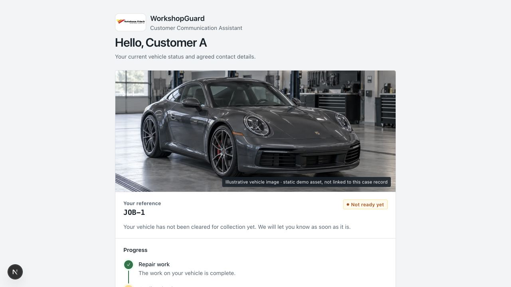
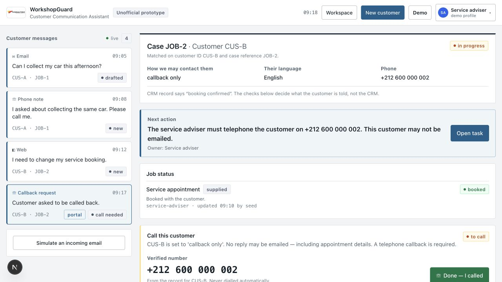

# WorkshopGuard

**Conflict-aware customer communication for vehicle workshops.**

WorkshopGuard brings customer messages, repair progress, quality checks, booking information and communication permissions into one controlled workflow. It helps a service adviser safely answer questions such as:

> “Is my vehicle ready for collection?”

AI understands messages and prepares multilingual drafts. Deterministic rules handle customer matching, permissions, conflicting workshop information and customer promises. Risky actions require approval from the appropriate employee.



> **Prototype notice**
>
> WorkshopGuard is an independent demonstration built with synthetic customers, vehicles, jobs and messages. It is not connected to a real garage or its customers.

## The problem

A garage may store information in different places: a technician updates repair progress, a quality inspector records the final check, a service adviser reads the CRM, and a customer writes through email or a portal. Those records can disagree.

For Customer A, repair work is finished and the CRM says the vehicle is ready, but the quality check is pending. An adviser who reads only the CRM could make a collection promise the workshop cannot support. WorkshopGuard detects the conflict, blocks that promise and names the employee who must act next.

## How WorkshopGuard works

Every channel enters the same controlled pipeline:



AI handles language, intent, summaries and multilingual drafts. Deterministic code handles identity, permissions, record conflicts, state transitions and promises. AI cannot complete a physical vehicle check or independently confirm collection. Important recommendations include their evidence, uncertain identities stop for manual review, and important actions are recorded.

## Example customer journey

1. Customer A asks whether the vehicle is ready for collection.
2. WorkshopGuard verifies the customer and job and gathers repair, CRM and quality information.
3. It detects that the records disagree and blocks an unsupported collection promise.
4. AI prepares a safe response in the customer's preferred language.
5. The quality inspector completes the pending check.
6. The service adviser reviews the evidence, approves the response and confirms collection.
7. The customer sees the approved status and message; the decision remains in the audit history.

See the [repeatable demo guide](docs/demo-guide.md) for Customer A, Customer B, intake and manual review.

## Communication channels

The channel through which a message arrives is not necessarily the channel through which the garage is permitted to respond.

| Channel | Incoming | Outgoing | Current status |
| --- | --- | --- | --- |
| Customer portal | Yes | Safe status and approved messages | Implemented demo |
| Email | Yes | Employee-approved email | Implemented with test restrictions |
| Telephone | Phone notes | Manual callback task | Simulated |
| WhatsApp | Not yet | Not yet | Roadmap |

The portal exposes a customer-safe projection and accepts messages or appointment-time requests; a request is not a confirmation. Inbound email uses a signature-verified Resend webhook and the same deterministic matching rules. Outbound email is restricted to one allow-listed test address. Callback-only customers create a manual call task instead of an email draft. [Communication-channel details](docs/communication-channels.md).

## Employee roles

- **Technician:** updates whether repair work is complete; cannot approve customer responses or confirm collection.
- **Quality inspector:** completes or rejects the final quality check; cannot promise collection.
- **Service adviser:** reviews evidence, communicates with the customer and confirms collection only after required checks pass.

This separation prevents one employee—or an AI model—from controlling the complete process.

## Main features

- deterministic customer and case matching using customer ID plus case reference;
- conflict detection across CRM, workshop and quality-check state;
- multilingual AI drafting with a disclosed offline fallback;
- a deterministic promise guardrail over AI output and human edits;
- evidence-backed recommendations and role-specific workflows;
- customer-safe portal projection, callback tasks and appointment requests;
- complete audit history and a repeatable reset state;
- real Resend inbound/outbound paths with strict demo restrictions.

### Product views

| Prepared response and evidence | Quality-inspector workflow |
| --- | --- |
|  |  |
| Customer-safe portal | Callback-only workflow |
|  |  |

## Safety and human approval

Unsupported promises are blocked even when a human edits them into a draft. Uncertain customer identities require manual review, the original message remains intact, and cross-customer case linking is refused. Only a service adviser can approve a response or confirm collection; only the inspector can complete the quality check. Read the [safety boundaries](docs/safety-boundaries.md).

## Quick start

Requires Node.js 20+ and npm.

```bash
npm install
cp .env.example .env.local   # optional; the demo runs without API keys
npm run dev                  # http://localhost:3000
```

Reset from the top-bar **Demo** menu before a walkthrough. Without keys, drafting uses the labelled rule-based fallback and email is simulated.

```bash
npm test       # 87 tests; no network or browser required
npm run check  # complete Customer A smoke check
npx tsc --noEmit
```

Do not run a production build while the development server is running because both use `.next/`.

## Technology stack

Next.js 15, React 19, TypeScript, Tailwind CSS 4, Node's test runner, a pluggable DeepSeek/rule-based drafting adapter, and Resend for restricted email integration. State is held by an in-memory store with a local runtime snapshot for demo continuity.

## What is real and simulated

| Component | Status | Boundary |
| --- | --- | --- |
| Matching, permissions, conflict rules, transitions and audit | Implemented | Deterministic application code |
| Customer-safe portal projection | Implemented demo | ID + case reference is demonstration access, not production authentication |
| AI drafting and summaries | Implemented | DeepSeek when configured; labelled rule-based fallback otherwise |
| Promise guardrail | Implemented | Checks model output and employee edits |
| Inbound email | Implemented | Signature-verified Resend webhook; requires a public endpoint |
| Outbound email | Implemented with test restriction | One configured allow-listed address only |
| Telephone call | Simulated | An employee completes the call manually |
| External booking update | Simulated | Recorded as `SIMULATED`; no booking system is connected |
| Employee profile switch | Demonstration only | Not authentication or identity management |

## Architecture

`app/` contains the employee workspace, portal and API routes. `lib/domain/` contains the deterministic rules; `lib/ai/` handles language generation behind an adapter; `lib/email/` contains Resend boundaries; and `lib/store/` builds a repeatable state from the read-only challenge record plus a labelled synthetic overlay. The UI and API share the same permission table and transition functions.

Detailed operational material lives in [`docs/`](docs/): [demo](docs/demo-guide.md), [channels](docs/communication-channels.md), [safety](docs/safety-boundaries.md), [garage adoption](docs/garage-adoption.md), [limitations](docs/limitations.md), [project origin](docs/project-origin.md), and [Resend inbound setup](docs/resend-inbound.md).

## Adapting it for another garage

A real garage would connect its CRM/customer records, workshop job system, quality-check process, communication providers, employee identities and booking system. It would configure its own statuses, roles, approval rules, communication permissions, supported languages and collection requirements. WorkshopGuard is not a drop-in production system; it demonstrates the workflow and rule boundaries a production integration needs. See the [garage adoption guide](docs/garage-adoption.md).

## Limitations

The current build uses in-memory demo state, demonstration-only role and portal access, two seeded cases, exercise-local appointment times and polling rather than push updates. It has not been tested at production volume or against live garage systems. It performs no vehicle diagnosis. See [limitations and production validation steps](docs/limitations.md).

## Roadmap

WhatsApp Business is the next planned communication channel. A future WhatsApp message would enter the same inbox, be matched to a verified customer and job, be checked against current workshop information and communication permissions, stop for manual review when uncertain, and receive an employee-approved WhatsApp response. It would be another channel around the same safety pipeline—not a separate decision system.

## Six-hour hackathon origin

WorkshopGuard was originally designed and built in six hours during **DaiL Octopus Day 2026** for case C01, “The customer who keeps calling.”

The six-hour build focused on one complete workflow: receiving a customer question, detecting conflicting workshop information, preparing a safe multilingual response, involving the appropriate employees and recording the final decision.

The functional prototype was created during the event. GitHub documentation, generic WorkshopGuard branding and repository presentation were refined afterward. [Read the project origin](docs/project-origin.md).

## Licensing note

No project licence has been added yet. The WorkshopGuard application code, supplied synthetic C01 exercise material and any third-party names or assets may have different ownership or licensing terms. Do not assume permission to redistribute or reuse them until the repository owner documents those terms.
